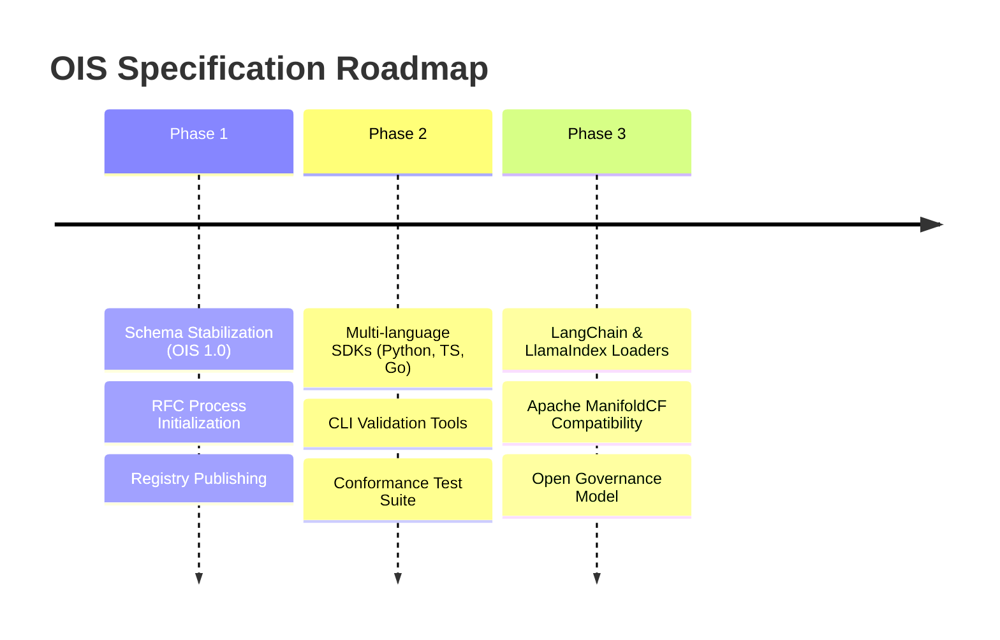

<!--
Copyright © 2026 the original author or authors (piergiorgio@apache.org)

Licensed under the Apache License, Version 2.0 (the "License");
you may not use this file except in compliance with the License.
You may obtain a copy of the License at

    http://www.apache.org/licenses/LICENSE-2.0

Unless required by applicable law or agreed to in writing, software
distributed under the License is distributed on an "AS IS" BASIS,
WITHOUT WARRANTIES OR CONDITIONS OF ANY KIND, either express or implied.
See the License for the specific language governing permissions and
limitations under the License.
-->

# Open Ingestion Standard (OIS) Roadmap 🗺️

This document outlines the strategic phases, releases, and milestones planned for the development and adoption of the **Open Ingestion Standard (OIS)**. 

Our ultimate goal is to establish a secure, vendor-neutral, and decoupled specification for enterprise data routing into modern vector databases and AI architectures.

---

## 📅 Roadmap Overview

---

## 🛠️ Phase 1: Specification Stabilization & Schema 1.0.0 (Short-Term)
**Focus:** Finalize current schemas, validate core zero-trust security assumptions, and formalize the extension model.

- [ ] **Release OIS 1.0.0-RC1 (Release Candidate)**
  - Finalize core validation constraints in [document.schema.json](schemas/document.schema.json) and [job.schema.json](schemas/job.schema.json).
  - Clarify the claim check lifecycle and requirements for temporary shared storage structures.
- [ ] **Initiate RFC (Request for Comments) Workflows**
  - Establish a formal RFC template and process for spec amendments.
  - Publish **RFC-001 (Security Identity Mapping)**: Discuss representation standards for complex active directory nested groups, OAuth scopes, and hybrid cloud ACL matrices.
- [ ] **Public Schema Registries**
  - Host versioned JSON schema files at static, accessible endpoints for automated IDE/CI integrations.
  - Set up automated schema testing using standard validator libraries in github workflows.

---

## ⚙️ Phase 2: Tooling, SDKs & Conformance Testing (Medium-Term)
**Focus:** Make it easy to adopt OIS by providing ready-to-use client libraries, validation tools, and tests.

- [ ] **`ois-validator` CLI**
  - Develop a lightweight, cross-platform CLI tool to quickly validate document payloads and configuration files against OIS schemas.
- [ ] **Standard SDK Libraries**
  - **OIS Python SDK**: Target AI/ML developers creating RAG pipelines with packages for payload validation and metadata formatting.
  - **OIS TypeScript SDK**: Support Node.js/web-based backend workflows.
  - **OIS Go SDK**: Target high-performance systems and connector agents.
- [ ] **Conformance Test Suite**
  - Establish a standard set of mock payloads, complex ACL variations, and configuration files to certify that third-party connectors are OIS-compliant.

---

## 🌐 Phase 3: Integration, Compatibility & Governance (Long-Term)
**Focus:** Drive wide-scale industry adoption, integrate with existing systems, and establish vendor-neutral steering.

- [ ] **Framework Core Integrations**
  - Build community-supported loaders for popular AI orchestrators like **LlamaIndex**, **LangChain**, and **Haystack** to natively process OIS payloads.
- [ ] **Connector Bridging**
  - Partner with open-source ingestion platforms (such as Apache ManifoldCF) to write translation layers that convert legacy connector configurations into standardized OIS configuration schemas.
- [ ] **Vendor-Neutral Governance**
  - Form an OIS steering committee with representatives from enterprise search, connector vendors, and vector database developers.
  - Transition the repository to an established open steering group (e.g. Linux Foundation, CNCF) to guarantee long-term vendor neutrality.

---

## 🤝 Contributing
We welcome help on all phases of this roadmap. If you are interested in working on schema refinements, SDKs, or integrations, please view our [MANIFESTO.md](MANIFESTO.md), participate in open issues, or start a new RFC discussion on GitHub!
