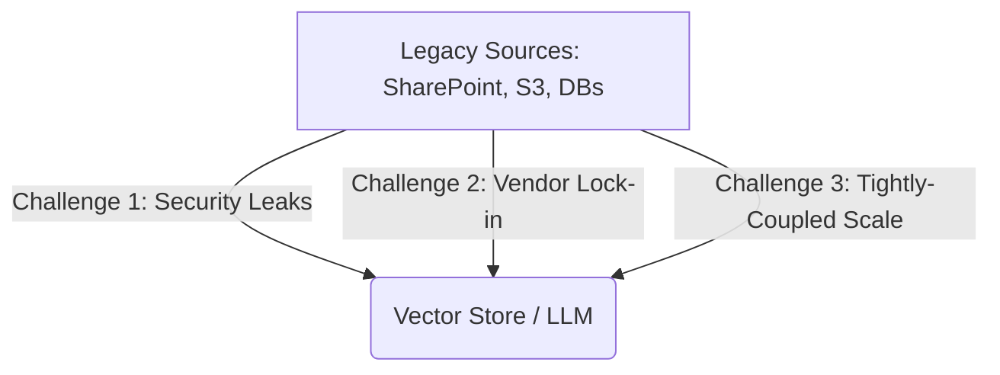
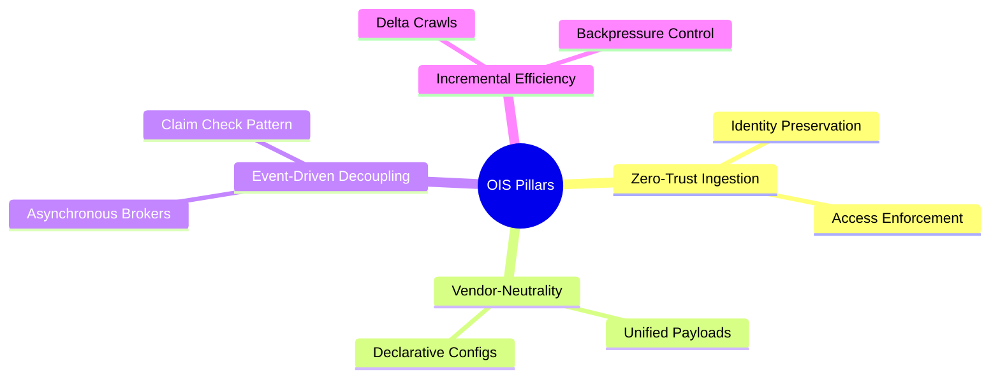

# Open Ingestion Standard (OIS) White Paper
*A secure, decoupled, and vendor-neutral specification for enterprise AI and RAG data ingestion.*

---

## Executive Summary
As enterprises increasingly adopt Retrieval-Augmented Generation (RAG) and Large Language Model (LLM) architectures, the bottleneck has shifted from model capability to **data logistics**. Extracting structured and unstructured information from legacy repository ecosystems—such as SharePoint, cloud storage buckets, databases, local file systems, CMIS repositories, and BPMN 2.0 workflow engines—and routing it to vector databases remains a highly brittle, insecure, and vendor-locked endeavor.

The **Open Ingestion Standard (OIS)** is a platform-agnostic specification, community manifesto, and schema standard designed to establish:
1. **Zero-Trust Security Preservation:** Propagating legacy system Access Control Lists (ACLs) directly to vector indexes.
2. **Vendor-Neutral Data Exchange:** Standardizing how documents, metadata, and security payloads are formatted.
3. **Decoupled Event-Driven Scaling:** Leveraging asynchronous brokers and the Claim Check pattern to handle large-scale enterprise data streams.
4. **Declarative Pipeline Management:** Providing a unified schema to define crawlers, transformers/narrativizers, splitters, embedders, and writers.

This white paper details the design requirements, architectural foundations, schemas, and reference implementations of OIS.

### Conformance & Terminology

The key words "MUST", "MUST NOT", "REQUIRED", "SHALL", "SHALL NOT", "SHOULD", "SHOULD NOT", "RECOMMENDED", "MAY", and "OPTIONAL" in this document are to be interpreted as described in RFC 2119.

---

## 1. The Enterprise Ingestion Crisis
Modern enterprise search and RAG platforms face three critical bottlenecks:



### Challenge 1: Security & Compliance Gaps (The ACL Leak)
Traditional search engines maintained strict document-level security. In modern AI architectures, files are processed, chunked, and embedded into vector databases. If the original security identifiers (Active Directory SIDs, OAuth groups, local roles) are discarded during chunking, the vector store becomes a security hazard. Any user querying the LLM can inadvertently retrieve chunks of proprietary files (e.g., payroll records, patent drafts) that they are not authorized to view.

### Challenge 2: Vendor Lock-in
Enterprise pipelines are typically built using vendor-specific ingestion tools. If an organization decides to transition from one vector database provider to another, or from a cloud embedding API to local models, they are forced to rewrite their entire ingestion code. There is no standard format to represent either the document payloads or the crawling job configurations.

### Challenge 3: Monolithic Scaling Constraints
Processing large binary documents (e.g., multi-hundred page PDF manuals) requires significant CPU resources for text extraction and GPU resources for vector embeddings. If these phases are tightly coupled inside a single process, the ingestion engine degrades. Large files block the pipeline, leading to backpressure and service outages.

---

## 2. Core Architectural Pillars
OIS is built on four core principles designed to resolve these challenges:



### Pillar 1: Zero-Trust Ingestion
Document security MUST be treated as a first-class citizen. Compliance requires:
* **Identity Preservation:** Access Control Lists (ACLs) containing Windows SIDs, oauth groups, or email roles MUST be parsed at the source and mapped directly to the document metadata envelope.
* **Synchronized Access Enforcement:** Downstream search queries MUST execute filtering against these ingested security properties to ensure that users only retrieve chunks they are explicitly permitted to read.

### Pillar 2: Vendor-Neutral Interoperability
By decoupling the source connector from the target vector writer, OIS ensures absolute flexibility:
* **Standard Exchange Formats:** All extracted data MUST be encapsulated in a schema-compliant JSON structure.
* **Declarative Pipeline Configuration:** Crawlers, schedules, transformations/narrativizations, chunking strategies, and embedding models MUST be configured using standard, platform-agnostic JSON/YAML descriptors.

### Pillar 3: Event-Driven Decoupling
To achieve horizontal scaling, OIS pipelines MUST isolate tasks:
* **Asynchronous Message Broker:** Document ingestion MUST be broken down into discrete steps (Scan $\to$ Extract $\to$ Transform $\to$ Chunk $\to$ Embed $\to$ Index) managed by an event broker (e.g., Apache Kafka).
* **Claim Check Pattern:** Standard queue messages MUST be lightweight. Large binary files are stored in a temporary shared repository (e.g., S3, local filesystem check), and the queue message carries a URI reference (the *claim check*) to prevent broker saturation.

### Pillar 4: Incremental Efficiency
To protect enterprise source systems from resource exhaustion:
* **Stateful Delta Crawls:** Connectors MUST track incremental cursors, only publishing documents that have been modified, created, or deleted.
* **Dynamic Backpressure:** Subsystems MUST adjust consumption rates to match downstream indexing and embedding throughput.

---

## 3. OIS Schema Specifications

OIS formalizes two primary JSON schemas:

### A. Document Payload Schema
The `document.schema.json` dictates how document text, metadata, and security settings are wrapped for transport.

```json
{
  "$schema": "http://json-schema.org/draft-07/schema#",
  "$id": "https://opencrawling.org/schemas/ois-document-schema.json",
  "title": "OIS Document Payload Schema",
  "type": "object",
  "required": ["id", "source", "content", "metadata", "security"],
  "properties": {
    "id": { "type": "string" },
    "source": {
      "type": "object",
      "required": ["type", "instance"],
      "properties": {
        "type": { "type": "string" },
        "instance": { "type": "string", "format": "uri-reference" }
      }
    },
    "content": {
      "type": "object",
      "required": ["mimeType"],
      "properties": {
        "mimeType": { "type": "string" },
        "text": { "type": "string" },
        "claimCheckUri": { "type": "string", "format": "uri-reference" }
      }
    },
    "metadata": { "type": "object", "additionalProperties": true },
    "security": {
      "type": "object",
      "required": ["inheritanceEnabled", "permissions"],
      "properties": {
        "inheritanceEnabled": { "type": "boolean" },
        "permissions": {
          "type": "array",
          "items": {
            "type": "object",
            "required": ["identity", "identityType", "access"],
            "properties": {
              "identity": { "type": "string" },
              "identityType": { "type": "string" },
              "access": { "type": "string", "enum": ["read", "write", "deny"] }
            }
          }
        }
      }
    }
  }
}
```

### B. Job Configuration Schema
The `job.schema.json` defines declarative templates to schedule and orchestrate ingestion runs.

```json
{
  "$schema": "http://json-schema.org/draft-07/schema#",
  "$id": "https://opencrawling.org/schemas/ois-job-schema.json",
  "title": "OIS Ingestion Job Configuration Schema",
  "type": "object",
  "required": ["version", "metadata", "spec"],
  "properties": {
    "version": { "type": "string" },
    "metadata": {
      "type": "object",
      "required": ["name"],
      "properties": {
        "name": { "type": "string" }
      }
    },
    "spec": {
      "type": "object",
      "required": ["schedule", "connector", "output"],
      "properties": {
        "schedule": { "type": "string" },
        "connector": {
          "type": "object",
          "required": ["type", "config"]
        },
        "pipeline": {
          "type": "object",
          "properties": {
            "textExtraction": {
              "type": "object",
              "properties": {
                "tikaEnabled": { "type": "boolean" },
                "ocrEnabled": { "type": "boolean" }
              }
            },
            "transformation": {
              "type": "object",
              "properties": {
                "strategy": { "type": "string", "enum": ["mustache", "json-to-text", "none"] },
                "template": { "type": "string" }
              }
            },
            "chunking": {
              "type": "object",
              "properties": {
                "strategy": { "type": "string", "enum": ["token-split", "sentence-split", "page-split"] },
                "maxTokens": { "type": "integer" },
                "overlap": { "type": "integer" }
              }
            },
            "embedding": {
              "type": "object",
              "required": ["model", "provider"],
              "properties": {
                "model": { "type": "string" },
                "provider": { "type": "string" },
                "endpoint": { "type": "string", "format": "uri-reference" }
              }
            }
          }
        },
        "output": {
          "type": "object",
          "required": ["type", "config"]
        }
      }
    }
  }
}
```

### C. CMIS and BPMN 2.0 Extensions

To support legacy Enterprise Content Management (ECM) and Business Process Management (BPM) ecosystems, OIS defines standard mappings for:

#### 1. Content Management Interoperability Services (CMIS)
Enterprise repositories complying with the CMIS standard expose hierarchical objects (documents, folders) and detailed metadata. OIS represents CMIS objects by mapping:
* **Source Type**: Set `source.type` to `cmis`.
* **Metadata Envelope**: CMIS-specific properties are prefixed with `cmis:` (e.g., `cmis:objectId`, `cmis:objectTypeId`, `cmis:versionLabel`, `cmis:creationDate`, `cmis:createdBy`).
* **Security Model**: CMIS Access Control Entries (ACEs) map directly to OIS `security.permissions`, setting the identity types to `cmis-user` or `cmis-group`.

#### 2. BPMN 2.0 Business Processes & Workflow Instances
To index the dynamic execution state of process instances from engines like Camunda, Flowable, or jBPM, OIS represents workflow instances as queryable documents:
* **Source Type**: Set `source.type` to `bpmn2`.
* **Metadata Envelope**: Ingests process definition, variables, and history under `bpmn:` prefix (e.g., `bpmn:processInstanceId`, `bpmn:processDefinitionKey`, `bpmn:status`, `bpmn:variables`, `bpmn:activeTasks`).
* **Active Tasks Mapping**: The active activities, assignees, and candidate groups are indexed inside `bpmn:activeTasks` to support real-time context mapping.
* **Security Model**: Security restrictions map dynamically based on runtime participation roles. The `security.permissions` array registers identities with types like `bpmn-assignee`, `bpmn-candidate-user`, `bpmn-candidate-group`, or `bpmn-supervisor` to restrict query visibility to users involved in the active task or process hierarchy.

---

## 4. Reference Implementation: OpenCrawling
The open-source **OpenCrawling** platform serves as the reference implementation for OIS. It showcases how a decoupled, Java-based runtime can scale ingestion using Kafka, Spring AI, PostgreSQL, and Ollama.

```
                  +--------------------------------+
                  |  OpenCrawling Repository Scan  |
                  +---------------+----------------+
                                  |
                                  v  (IngestionMessage)
                  +---------------+----------------+
                  |      Kafka Ingestion Topic     |
                  +---------------+----------------+
                                  |
                                  v  (Tika / Tokenizer)
                  +---------------+----------------+
                  |     Kafka Document Chunks      |
                  +---------------+----------------+
                                  |
                                  v  (Ollama Embeddings Router)
           +----------------------+----------------------+
           |                      |                      |
           v (384-dim)            v (768-dim)            v (1024-dim)
    [vector_store_384]     [vector_store_768]     [vector_store_1024]
```

### Flexible Routing & Dimension Mapping
OpenCrawling utilizes OIS's job configuration to deploy different embedding models dynamically. It resolves model names to vector store tables optimized for specific dimensional requirements:
* **all-minilm** (384-dim): Maps payloads to the database table `vector_store_384`.
* **nomic-embed-text** (768-dim): Maps payloads to `vector_store_768`.
* **mxbai-embed-large** (1024-dim, default): Maps payloads to `vector_store_1024`.

By decoupling the embedding consumer from the database writer, OpenCrawling achieves sub-millisecond table routing without requiring recompilation of the pipeline.

---

## 5. Roadmap & Open Governance
The OIS Initiative is designed for long-term community stewardship. The project roadmap is split into three phases:

1. **Phase 1: Schema Stabilization (Current)**
   * Finalize the OIS 1.0 specifications.
   * Implement automated CI schemas validation.
2. **Phase 2: Client SDKs & Tools**
   * Release official Python, Go, and TypeScript SDKs to help developers write compliant source connectors and output writers.
   * Publish CLI validation binaries.
3. **Phase 3: Governance Transition**
   * Transition the standard repository to a neutral open-source organization (e.g. Linux Foundation, CNCF) to prevent proprietary vendor lock-in.

---

## Conclusion
The **Open Ingestion Standard** bridges the security and scalability gaps in enterprise RAG pipelines. By standardizing document payloads, preserving source-level security credentials, and enabling declarative configurations, OIS provides a blueprint for robust, future-proof AI data logistics.

For detailed schema files, manifestos, and examples, visit the standard repository: [open-ingestion-standard](file:///Users/piergiorgiolucidi/Documents/workspaces/opencrawling/open-ingestion-standard).
